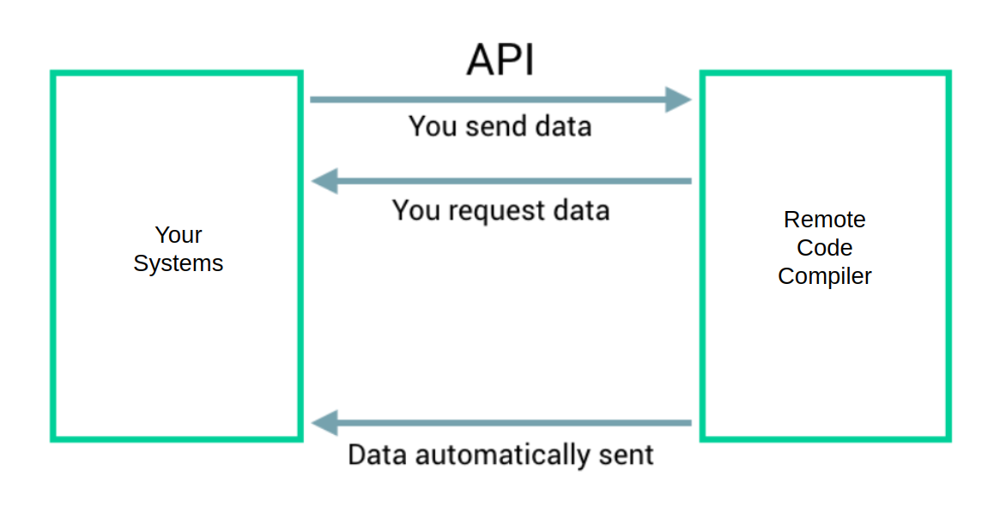
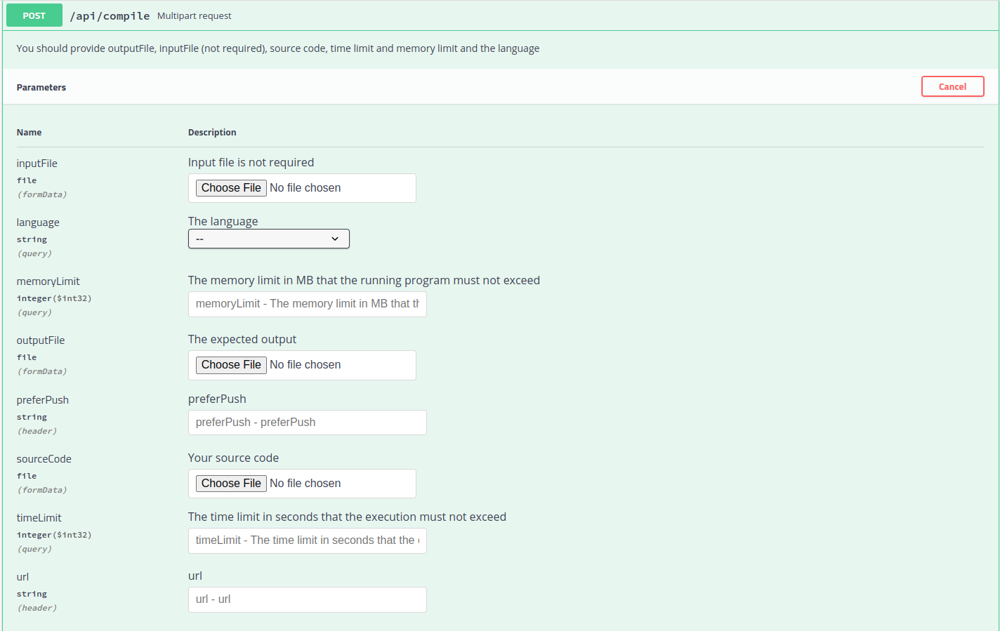

[](https://github.com/zakariamaaraki/RemoteCodeCompiler/actions/workflows/build.yaml) [](https://https://docker.com/) [](https://github.com/zakariamaaraki/RemoteCodeCompiler/actions/workflows/build.yaml)
[](https://github.com/zakariamaaraki/RemoteCodeCompiler/actions/workflows/codeAnalysis.yaml)
[](https://www.gnu.org/licenses/gpl-3.0)

# Remote Code Compiler

<pre>

 ____                               _               ____               _             ____                               _   _
 |  _ \    ___   _ __ ___     ___   | |_    ___     / ___|   ___     __| |   ___     / ___|   ___    _ __ ___    _ __   (_) | |   ___   _ __
 | |_) |  / _ \ | '_ ` _ \   / _ \  | __|  / _ \   | |      / _ \   / _` |  / _ \   | |      / _ \  | '_ ` _ \  | '_ \  | | | |  / _ \ | '__|
 |  _ <  |  __/ | | | | | | | (_) | | |_  |  __/   | |___  | (_) | | (_| | |  __/   | |___  | (_) | | | | | | | | |_) | | | | | |  __/ | |
 |_| \_\  \___| |_| |_| |_|  \___/   \__|  \___|    \____|  \___/   \__,_|  \___|    \____|  \___/  |_| |_| |_| | .__/  |_| |_|  \___| |_|
                                                                                                                |_|

</pre>

An online code compiler supporting 11 languages (**Java**, **Kotlin**, **C**, **C++**, **C#**, **Golang**, **Python**, **Scala**, **Ruby**, **Rust** and **Haskell**) for competitive programming and coding interviews.
This service execute your code remotely using docker containers to separate environments of execution.


Supports **Rest Calls (Long Polling and [Push Notification](https://en.wikipedia.org/wiki/Push_technology))**, **Apache Kafka** and **Rabbit MQ Messages**.

**Example of an input**

```json
{
    "input": "9",
    "expectedOutput": "0 1 2 3 4 5 6 7 8 9",
    "sourceCode": "<YOUR_SOURCE_CODE>",
    "language": "JAVA",
    "timeLimit": 15,  
    "memoryLimit": 500 
}
```

**Example of an ouput**

The compiler cleans up your output, so having extra spaces or line breaks does not affect the status of the response.

```json
{
  "result": {
    "statusResponse": "Accepted",
    "statusCode": 100,
    "output": "0 1 2 3 4 5 6 7 8 9",
    "error": "",
    "expectedOutput": "0 1 2 3 4 5 6 7 8 9",
    "executionDuration": 2111
  },
  "dateTime": "2022-01-28T23:32:02.843465"
}
```

## Prerequisites

To run this project you need a docker engine running on your machine.

## Getting Started

Build docker image by typing the following command :

```shell
docker image build . -t compiler
```

Run the container by typing the following command

```shell
docker container run -p 8080:8082 -v /var/run/docker.sock:/var/run/docker.sock -e DELETE_DOCKER_IMAGE=true -e EXECUTION_MEMORY_MAX=10000 -e EXECUTION_MEMORY_MIN=0 -e EXECUTION_TIME_MAX=15 -e EXECUTION_TIME_MIN=0 -e MAX_REQUESTS=1000 -e MAX_EXECUTION_CPUS=0.2 -t compiler
```
* The value of the env variable **DELETE_DOCKER_IMAGE** is by default set to true, and that means that each docker image is deleted after the execution of the container. 
* The value of the env variable **EXECUTION_MEMORY_MAX** is by default set to 10 000 MB, and represents the maximum value of memory limit that we can pass in the request. **EXECUTION_MEMORY_MIN** is by default set to 0.
* The value of the env variable **EXECUTION_TIME_MAX** is by default set to 15 sec, and represents the maximum value of time limit that we can pass in the request. **EXECUTION_TIME_MIN** is by default set to 0.  
* **MAX_REQUESTS** represents the number of requests that can be executed in parallel. When this value is reached all incoming requests will be throttled, and the user will get 429 HTTP status code (there will be a retry in queue mode).
* **MAX_EXECUTION_CPUS** represents the maximum number of cpus to use for each execution (by default the maximum available cpus). If this value is set, then all requests will be throttled when the reach the maximum.
* **PULL_IMAGES_BEFORE_STARTUP** if it's set to true then the compiler will pull all images before starting the container to make first requests faster.


### Push Notifications




To enable push notifications you must set **ENABLE_PUSH_NOTIFICATION** to true

For long-running executions, you may want to get the response later and to avoid http timeouts, you can use push notifications,
to do so you must pass two header values (**url** where you want to get the response and set **preferPush** to prefer-push)

### Multipart request



## Local Run (for dev environment only)
See the documentation in the [local](https://github.com/zakariamaaraki/RemoteCodeCompiler/tree/master/local) folder, a docker-compose is provided.

```shell
docker-compose up --build
```

## On K8s

<p align="center">

</p>

You can use the provided helm chart to deploy the project on k8s, see the documentation in the [k8s](https://github.com/zakariamaaraki/RemoteCodeCompiler/tree/master/k8s) folder.

```shell
helm install compiler ./k8s/compiler
```

### AKS Provisioning
We provide you with a script to provision an AKS cluster to ease your deployment experience. See the documentation in the [provisioning](https://github.com/zakariamaaraki/RemoteCodeCompiler/tree/master/provisioning/arm) folder.

## How It Works

The compiler creates a container for each execution to separate the execution environments.


<p>
    Each container has a number of CPUs (the same value for all containers, we recommend to use 0.1 CPUs for each execution), 
a memory limit and execution time limit, once the memory limit or the maximum time granted to this container is reached 
the container is destroyed automatically and an error explaining the cause is returned to the user.
</p>

For the documentation visit the swagger page at the following url : http://<IP:PORT>/swagger-ui.html


### Verdicts

:tada: **Accepted**
```json
{
  "result": {
    "statusResponse": "Accepted",
    "statusCode": 100,
    "output": "YES",
    "error": "",
    "expectedOutput": "YES",
    "executionDuration": 73
  },
  "dateTime": "2022-01-28T23:32:02.843465"
}
```

:x: **Wrong Answer**

```json
{
  "result": {
    "statusResponse": "Wrong Answer",
    "statusCode": 200,
    "output": "YES",
    "error": "",
    "expectedOutput": "NO",
    "executionDuration": 116
  },
  "dateTime": "2022-01-28T23:32:02.843465"
}
```

:shit: **Compilation Error**

```json
{
  "result": {
    "statusResponse": "Compilation Error",
    "statusCode": 300,
    "output": "",
    "error": "# command-line-arguments\n./main.go:5:10: undefined: i\n./main.go:6:21: undefined: i\n./main.go:7:9: undefined: i\n",
    "expectedOutput": "1 2",
    "executionDuration": 0
  },
  "dateTime": "2022-06-05T19:21:25.547048"
}
```

:clock130: **Time Limit Exceeded** 
```json
{
  "result": {
    "statusResponse": "Time Limit Exceeded",
    "statusCode": 500,
    "output": "",
    "error": "Execution exceeded 15sec",
    "expectedOutput": "YES",
    "executionDuration": 15001
  },
  "dateTime": "2022-01-28T23:32:02.843465"
}
```

:boom: **Runtime Error** 
```json
{
  "result": {
    "statusResponse": "Runtime Error",
    "statusCode": 600,
    "output": "",
    "error": "panic: runtime error: integer divide by zero\n\ngoroutine 1 [running]:\nmain.main()\n\t/app/main.go:11 +0x9b\n",
    "expectedOutput": "1 2\n",
    "executionDuration": 13
  },
  "dateTime": "2022-06-05T19:10:34.357349"
}
```

:minidisc: **Out Of Memory** 
```json
{
  "result": {
    "statusResponse": "Out Of Memory",
    "statusCode": 400,
    "output": "",
    "error": "fatal error: runtime: out of memory\n\nruntime stack:\nruntime.throw({0x497d72?, 0x17487800000?})\n\t/usr/local/go/src/runtime/panic.go:992 +0x71\nruntime.sysMap(0xc000400000, 0x7ffccb36b0d0?, 0x7ffccb36b13...",
    "expectedOutput": "YES",
    "executionDuration": 12
  },
  "dateTime": "2022-06-05T19:17:35.384797"
}
```

### Visualize Docker images and containers infos
It is also possible to visualize information about the images and docker containers that are currently running using these endpoints


## Stream processing with Kafka Streams


You can use the compiler with an event driven architecture.
To enable kafka mode you must pass to the container the following env variables :
* **ENABLE_KAFKA_MODE** : True or False
* **KAFKA_INPUT_TOPIC** : Input topic, json request
* **KAFKA_OUTPUT_TOPIC** : Output topic, json response
* **KAFKA_CONSUMER_GROUP_ID** : Consumer group
* **KAFKA_HOSTS** : List of brokers
* **CLUSTER_API_KEY** : API key
* **CLUSTER_API_SECRET** : API Secret
* **KAFKA_THROTTLING_DURATION** : Throttling duration, by default set to 10000ms (when number of docker containers running reach MAX_REQUESTS, this value is used to do not lose the request and retry after this duration)

**More partitions => More Parallelism => Better performance**

```shell
docker container run -p 8080:8082 -v /var/run/docker.sock:/var/run/docker.sock -e DELETE_DOCKER_IMAGE=true -e EXECUTION_MEMORY_MAX=10000 -e EXECUTION_MEMORY_MIN=0 -e EXECUTION_TIME_MAX=15 -e EXECUTION_TIME_MIN=0 -e ENABLE_KAFKA_MODE=true -e KAFKA_INPUT_TOPIC=topic.input -e KAFKA_OUTPUT_TOPIC=topic.output -e KAFKA_CONSUMER_GROUP_ID=compilerId -e KAFKA_HOSTS=ip_broker1,ip_broker2,ip_broker3 -e API_KEY=YOUR_API_KEY -e API_SECRET=YOUR_API_SECRET -t compiler
```

## Queueing system with RabbitMq


To enable Rabbit MQ mode you must pass to the container the following env variables :
* **ENABLE_RABBITMQ_MODE** : True or False
* **RABBIT_QUEUE_INPUT** : Input queue, json request
* **RABBIT_QUEUE_OUTPUT** : Output queue, json response
* **RABBIT_USERNAME** : Rabbit MQ username  
* **RABBIT_PASSWORD** : Rabbit MQ password
* **RABBIT_HOSTS** : List of brokers
* **RABBIT_THROTTLING_DURATION** : Throttling duration, by default set to 10000ms (when number of docker containers running reach MAX_REQUESTS, this value is used to do not lose the request and retry after this duration)

```shell
docker container run -p 8080:8082 -v /var/run/docker.sock:/var/run/docker.sock -e DELETE_DOCKER_IMAGE=true -e EXECUTION_MEMORY_MAX=10000 -e EXECUTION_MEMORY_MIN=0 -e EXECUTION_TIME_MAX=15 -e EXECUTION_TIME_MIN=0 -e ENABLE_RABBITMQ_MODE=true -e RABBIT_QUEUE_INPUT=queue.input -e RABBIT_QUEUE_OUTPUT=queue.output -e RABBIT_USERNAME=username -e RABBIT_PASSWORD=password -e RABBIT_HOSTS=ip_broker1,ip_broker2,ip_broker3 -t compiler
```

## Monitoring

<p align="center">

</p>

Check out exposed prometheus metrics using the following url : http://<IP:PORT>/prometheus


Other metrics are available.

## Logging

<p>By default, only console logging is enabled.</p>

You can store logs in a file and access to it using /logfile endpoint by setting the environment variable **ROLLING_FILE_LOGGING** to true. 
All logs will be kept for 7 days with a maximum size of 1 GB.

<p align="center">

</p>

You can also send logs to logstash pipeline by setting these environment variables **LOGSTASH_LOGGING** to true and 
**LOGSTASH_SERVER_HOST**, **LOGSTASH_SERVER_PORT** to logstash and port values respectively. 

## Author

- **Zakaria Maaraki** - _Initial work_ - [zakariamaaraki](https://github.com/zakariamaaraki)
