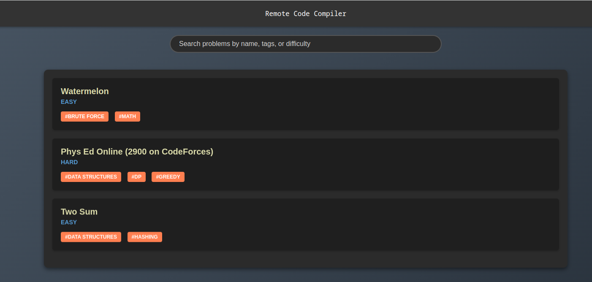

[](https://github.com/zakariamaaraki/RemoteCodeCompiler/actions/workflows/build.yaml) 
[](https://github.com/zakariamaaraki/RemoteCodeCompiler/actions/workflows/environment.yaml)
[](https://https://docker.com/)
[](https://github.com/zakariamaaraki/RemoteCodeCompiler/actions/workflows/build.yaml)
[](https://www.gnu.org/licenses/gpl-3.0)

# Remote Code Compiler


An online code compiler supporting 11 languages (**Java**, **Kotlin**, **C**, **C++**, **C#**, **Golang**, **Python**, **Scala**, **Ruby**, **Rust** and **Haskell**) for competitive programming and coding interviews.
This tool execute your code remotely using docker containers to separate environments of execution.


Supports **Rest Calls (Long Polling and [Push Notification](https://en.wikipedia.org/wiki/Push_technology))**, **Apache Kafka** and **Rabbit MQ Messages**, and **gRPC**.

## Table of Contents
- [Security Considerations](#security-considerations)
  - [Sandboxing](#sandboxing)
  - [Resource Limits](#resource-limits)
  - [Input Sanitization](#input-sanitization)
  - [Rate Limiting](#rate-limiting)
- [Garbage Collection](#garbage-collection)
- [Scalability](#scalability)
- [How It Works](#how-it-works)
- [Benchmark Report](#benchmark-report)
  - [Overview](#overview)
  - [Test Environment](#test-environment)
  - [Compilation Performance](#compilation-performance)
  - [Execution Performance](#execution-performance)
  - [Observations and Insights](#observations-and-insights)
- [Prerequisites](#prerequisites)
- [Getting Started](#getting-started)
- [Local Run (for dev environment only)](#local-run-for-dev-environment-only)
- [On K8s](#on-k8s)
- [APIs](#apis)
  - [Example of a REST call](#example-of-a-rest-call)
  - [Verdicts](#verdicts)
  - [How to Use It from the UI](#how-to-use-it-from-the-ui)
  - [Push Notifications](#push-notifications)
  - [Multipart Request](#multipart-request)
  - [With gRPC](#with-grpc)
- [Visualize Docker Images and Containers Information](#visualize-docker-images-and-containers-information)
- [Stream Processing with Kafka Streams](#stream-processing-with-kafka-streams)
- [Queueing System with RabbitMQ](#queueing-system-with-rabbitmq)
- [Monitoring](#monitoring)

## Security Considerations
The compiler ensures the security of user code execution by sandboxing the execution environment and applying strict resource limits. Additionally, input sanitization and validation are performed to prevent code injection attacks.

#### Sandboxing
The Remote Code Compiler employs sandboxing techniques to isolate user code executions from the underlying system. Each code execution occurs within a dedicated Docker container, providing a secure and contained environment. This isolation prevents unauthorized access to system resources and protects against potential security vulnerabilities.

#### Resource Limits
Strict resource limits are enforced to prevent resource exhaustion attacks and ensure fair resource allocation. The compiler sets limits on CPU usage, memory consumption, and execution time for each code execution. These limits mitigate the risk of denial-of-service (DoS) attacks and ensure the stability and reliability of the compiler platform.

#### Input Sanitization
Input sanitization measures are implemented to validate and sanitize user inputs before execution. This helps prevent code injection attacks and ensures that only safe and trusted inputs are processed by the compiler. By sanitizing inputs, the compiler reduces the risk of executing malicious code and maintains the integrity of the execution environment.

#### Rate Limiting
To ensure fair usage and protect the system from abuse, a rate limit of **5 requests per second (RPS) per user ID** is enforced. This rate limit can be overridden by setting the `MAX_USER_REQUESTS` environment variable to a different value. This flexibility allows you to adjust the rate limits based on specific needs or usage patterns.

## Garbage Collection
A garbage collector runs periodically to clean up any stuck executions and their associated resources, ensuring efficient resource utilization and preventing resource leaks.

## Scalability
The compiler can scale horizontally to handle increased load by deploying multiple instances behind a load balancer. Each instance is stateless and can independently process incoming requests, ensuring high availability and performance.

## How It Works

When a request arrives, the compiler gets to work by creating a special container just for compiling the code you sent. This container works closely with the main application, sharing its storage space for easy access to files. Once the code is compiled successfully, the compiler sets up separate containers for running each test. These containers work independently, each having its own space to run the code without being affected by others.


<p>
    In the execution step, each container is assigned a set number of CPUs (consistent across all containers,
with a recommended value of 0.1 CPUs per execution), as well as limits on memory and execution time. 
When the container hits either the memory threshold or the maximum time allowed, it is automatically terminated, 
and a user-facing error message is generated to explain the termination cause.
</p>

## Benchmark Report

### Overview

In our endeavor to develop a robust and efficient remote code compiler, we conducted a series of benchmark tests to evaluate the performance across multiple programming languages. The problem chosen for this benchmark is a simple problem from Codeforces: [Watermelon (Problem A from Contest 4)](https://codeforces.com/contest/4/problem/A). 

We executed 4000 test runs for each of 10 test cases in four different programming languages: Java, Python, C, and C++. This resulted in a total of 40000 executions and 3000 compilations.

### Test Environment

The tests were conducted on a virtual machine configured with:

- **Memory**: 8 GiB
- **vCPU**: 4 vCPU

This setup provided a controlled environment to ensure consistency and reliability in our benchmark results.

### Compilation Performance

#### Compilation Time Analysis

We measured the time taken to compile code for each of the four languages. Here are the key metrics:

- **Maximum Compilation Duration**: 0.950406434 seconds
- **Average Compilation Duration**: 0.82969625775 seconds
- **95th Percentile Compilation Duration**: 0.912345678 seconds

The average compilation duration provides a reliable estimate of how long it typically takes to compile code, while the maximum and 95th percentile durations indicate the upper bounds under the test conditions.

> *Remark: The compilation time includes the time taken for the creation of the container.*

### Compilation Time Distribution

| Language | Max Compilation Time (s) | Avg Compilation Time (s) | 95th Percentile Compilation Time (s) |
|----------|---------------------------|--------------------------|--------------------------------------|
| Java     | 0.950406434               | 0.82969625775            | 0.912345678                          |
| Python   | N/A                       | N/A                      | N/A                                  |
| C        | 0.812345678               | 0.78912345678            | 0.805678912                          |
| C++      | 0.834567890               | 0.81234567890            | 0.825678901                          |

*Note: Python is an interpreted language and does not require a separate compilation step, hence the N/A values.*

### Execution Performance

#### Execution Time Analysis

We measured the execution time for each test case. The execution duration reflects the time taken to execute one test case. The aggregate execution duration for all test cases was also computed to understand the overall performance.

- **Maximum Execution Duration (Single Test Case)**: 0.601810192 seconds
- **Average Execution Duration (Single Test Case)**: 0.52991365113 seconds
- **95th Percentile Execution Duration (Single Test Case)**: 0.589123456 seconds

Given that the problem have 10 test cases, the total execution duration for all test cases is:

- **Total Execution Duration (All Test Cases)**: 10 * 0.52991365113 seconds = 5.2991365113 seconds

> *Remark: The execution time includes the time taken for the creation of the container and running it.*

#### Execution Time Distribution

| Language | Max Execution Time (s) | Avg Execution Time (s) | 95th Percentile Execution Time (s) |
|----------|-------------------------|------------------------|------------------------------------|
| Java     | 0.601810192             | 0.52991365113          | 0.589123456                        |
| Python   | 0.701234567             | 0.62345678912          | 0.689123456                        |
| C        | 0.498765432             | 0.45678901234          | 0.478901234                        |
| C++      | 0.512345678             | 0.46789012345          | 0.489012345                        |

### Observations and Insights


- **Java** demonstrated a relatively high compilation time but maintained consistent execution performance.
- **Python**, while not requiring compilation, had longer execution times, which is expected due to its interpreted nature.
- **C** and **C++** showed strong performance both in compilation and execution, making them highly efficient for this type of computational task.
- The 95th percentile times provide insights into the tail performance, ensuring our compiler handles the majority of cases efficiently.

## Prerequisites

To run this project you need a docker engine running on your machine.

## Getting Started

1- Build a docker image:

```shell
docker image build . -t compiler
```

2- Create a volume:

```shell
docker volume create compiler
```

3- build the necessary docker images used by the compiler

```shell
./environment/build.sh
```

4- Run the container:

```shell
docker container run -p 8080:8082 -v /var/run/docker.sock:/var/run/docker.sock -v compiler:/compiler -e DELETE_DOCKER_IMAGE=true -e EXECUTION_MEMORY_MAX=10000 -e EXECUTION_MEMORY_MIN=0 -e EXECUTION_TIME_MAX=15 -e EXECUTION_TIME_MIN=0 -e MAX_REQUESTS=1000 -e MAX_EXECUTION_CPUS=0.2 -e COMPILATION_CONTAINER_VOLUME=compiler -t compiler
```
* The value of the env variable **DELETE_DOCKER_IMAGE** is by default set to true, and that means that each docker image is deleted after the execution of the container. 
* The value of the env variable **EXECUTION_MEMORY_MAX** is by default set to 10 000 MB, and represents the maximum value of memory limit that we can pass in the request. **EXECUTION_MEMORY_MIN** is by default set to 0.
* The value of the env variable **EXECUTION_TIME_MAX** is by default set to 15 sec, and represents the maximum value of time limit that we can pass in the request. **EXECUTION_TIME_MIN** is by default set to 0.  
* **MAX_REQUESTS** represents the number of requests that can be executed in parallel. When this value is reached all incoming requests will be throttled, and the user will get 429 HTTP status code (there will be a retry in queue mode).
* **MAX_EXECUTION_CPUS** represents the maximum number of cpus to use for each execution (by default the maximum available cpus). If this value is set, then all requests will be throttled when the service reaches the maximum.
* **COMPILATION_CONTAINER_VOLUME** It should be the same as the volume created in step 2.
* **MAX_TEST_CASES** Maximum number of test cases a request should handle (by default it's set to 20)

## Local Run (for dev environment only)
See the documentation in the [local](https://github.com/zakariamaaraki/RemoteCodeCompiler/tree/master/local) folder, a docker-compose is provided.

```shell
docker-compose up --build
```

## On K8s

<p align="center">

</p>

You can use the provided helm chart to deploy the project on k8s, see the documentation in the [k8s](https://github.com/zakariamaaraki/RemoteCodeCompiler/tree/master/k8s) folder.

```shell
helm install compiler ./k8s/compiler
```

### AKS Provisioning
We provide you with a script to provision an AKS cluster to ease your deployment experience. See the documentation in the [provisioning](https://github.com/zakariamaaraki/RemoteCodeCompiler/tree/master/provisioning/arm) folder.

## APIs

For the Rest API documentation visit the swagger page at the following url : http://<IP:PORT>/swagger-ui.html


### Example of a Rest call
```shell
curl  'http://localhost:8080/api/compile/json'  -X POST  -H 'Content-Type: application/json; charset=UTF-8'  --data-raw '{"sourcecode":"// Java code here\npublic class main {\n    public static void main(String[] args) {\n        System.out.println(\"NO\");\n    }\n}","language":"JAVA", "testCases": {"test1" : {"input" : "", "expectedOutput" : "NO"}}, "memoryLimit" : 500, "timeLimit": 2 }'
```

> **_NOTE:_** The time limit in the request should be in seconds (s) and the memory limit in megabytes (MB).

### Verdicts

Here is a list of Verdicts that can be returned by the compiler:

> **_NOTE:_** The time limit is in milliseconds (ms) and the memory limit is in megabytes (MB).

:tada: **Accepted**
```json
{
    "verdict": "Accepted",
    "statusCode": 100,
    "error": "",
    "testCasesResult": {
      "test1": {
        "verdict": "Accepted",
        "verdictStatusCode": 100,
        "output": "0 1 2 3 4 5 6 7 8 9",
        "error": "", 
        "expectedOutput": "0 1 2 3 4 5 6 7 8 9",
        "executionDuration": 175
      },
      "test2": {
        "verdict": "Accepted",
        "verdictStatusCode": 100,
        "output": "9 8 7 1",
        "error": "" ,
        "expectedOutput": "9 8 7 1",
        "executionDuration": 273
      },
      ...
    },
    "compilationDuration": 328,
    "averageExecutionDuration": 183,
    "timeLimit": 1500,
    "memoryLimit": 500,
    "language": "JAVA",
    "dateTime": "2022-01-28T23:32:02.843465"
}
```

:x: **Wrong Answer**

```json
{
    "verdict": "Wrong Answer",
    "statusCode": 200,
    "error": "",
    "testCasesResult": {
      "test1": {
        "verdict": "Accepted",
        "verdictStatusCode": 100,
        "output": "0 1 2 3 4 5 6 7 8 9",
        "error": "", 
        "expectedOutput": "0 1 2 3 4 5 6 7 8 9",
        "executionDuration": 175
      },
      "test2": {
        "verdict": "Wrong Answer",
        "verdictStatusCode": 200,
        "output": "9 8 7 1",
        "error": "" ,
        "expectedOutput": "9 8 6 1",
        "executionDuration": 273
      }
    },
    "compilationDuration": 328,
    "averageExecutionDuration": 183,
    "timeLimit": 1500,
    "memoryLimit": 500,
    "language": "JAVA",
    "dateTime": "2022-01-28T23:32:02.843465"
}
```

:shit: **Compilation Error**

```json
{
  "verdict": "Compilation Error",
   "statusCode": 300,
   "error": "# command-line-arguments\n./main.go:5:10: undefined: i\n./main.go:6:21: undefined: i\n./main.go:7:9: undefined: i\n",
   "testCasesResult": {},
   "compilationDuration": 118,
   "averageExecutionDuration": 0,
   "timeLimit": 1500,
   "memoryLimit": 500,
   "language": "GO",
   "dateTime": "2022-01-28T23:32:02.843465"
}
```

:clock130: **Time Limit Exceeded** 
```json
{
    "verdict": "Time Limit Exceeded",
    "statusCode": 500,
    "error": "Execution exceeded 15sec",
    "testCasesResult": {
      "test1": {
        "verdict": "Accepted",
        "verdictStatusCode": 100,
        "output": "0 1 2 3 4 5 6 7 8 9",
        "error": "", 
        "expectedOutput": "0 1 2 3 4 5 6 7 8 9",
        "executionDuration": 175
      },
      "test2": {
        "verdict": "Time Limit Exceeded",
        "verdictStatusCode": 500,
        "output": "",
        "error": "Execution exceeded 15sec" ,
        "expectedOutput": "9 8 7 1",
        "executionDuration": 1501
      }
    },
    "compilationDuration": 328,
    "averageExecutionDuration": 838,
    "timeLimit": 1500,
    "memoryLimit": 500,
    "language": "JAVA",
    "dateTime": "2022-01-28T23:32:02.843465"
}
```

:boom: **Runtime Error** 
```json
{
    "verdict": "Runtime Error",
    "statusCode": 600,
    "error": "panic: runtime error: integer divide by zero\n\ngoroutine 1 [running]:\nmain.main()\n\t/app/main.go:11 +0x9b\n",
    "testCasesResult": {
      "test1": {
        "verdict": "Accepted",
        "verdictStatusCode": 100,
        "output": "0 1 2 3 4 5 6 7 8 9",
        "error": "", 
        "expectedOutput": "0 1 2 3 4 5 6 7 8 9",
        "executionDuration": 175
      },
      "test2": {
        "verdict": "Runtime Error",
        "verdictStatusCode": 600,
        "output": "",
        "error": "panic: runtime error: integer divide by zero\n\ngoroutine 1 [running]:\nmain.main()\n\t/app/main.go:11 +0x9b\n" ,
        "expectedOutput": "9 8 7 1",
        "executionDuration": 0
      }
    },
    "compilationDuration": 328,
    "averageExecutionDuration": 175,
    "timeLimit": 1500,
    "memoryLimit": 500,
    "language": "GO",
    "dateTime": "2022-01-28T23:32:02.843465"
}
```

:minidisc: **Out Of Memory** 
```json
{
    "verdict": "Out Of Memory",
    "statusCode": 400,
    "error": "fatal error: runtime: out of memory\n\nruntime stack:\nruntime.throw({0x497d72?, 0x17487800000?})\n\t/usr/local/go/src/runtime/panic.go:992 +0x71\nruntime.sysMap(0xc000400000, 0x7ffccb36b0d0?, 0x7ffccb36b13...",
    "testCasesResult": {
      "test1": {
        "verdict": "Accepted",
        "verdictStatusCode": 100,
        "output": "0 1 2 3 4 5 6 7 8 9",
        "error": "", 
        "expectedOutput": "0 1 2 3 4 5 6 7 8 9",
        "executionDuration": 175
      },
      "test2": {
        "verdict": "Out Of Memory",
        "verdictStatusCode": 400,
        "output": "",
        "error": "fatal error: runtime: out of memory\n\nruntime stack:\nruntime.throw({0x497d72?, 0x17487800000?})\n\t/usr/local/go/src/runtime/panic.go:992 +0x71\nruntime.sysMap(0xc000400000, 0x7ffccb36b0d0?, 0x7ffccb36b13..." ,
        "expectedOutput": "9 8 7 1",
        "executionDuration": 0
      }
    },
    "compilationDuration": 328,
    "averageExecutionDuration": 175,
    "timeLimit": 1500,
    "memoryLimit": 500,
    "language": "GO",
    "dateTime": "2022-01-28T23:32:02.843465"
}
```

#### How to use it from the UI

The compiler is equipped with some problems specified in the problems.json file located in the resource folder. These problem sets are automatically loaded upon project startup, granting you the opportunity to explore and test them through the **/problems** endpoint.



### Push Notifications
You may want to get the response later and to avoid http timeouts, you can use push notifications,
to do so you should pass two header values (**url** where you want to get the response and set **preferPush** to prefer-push)


To enable push notifications you should set the environment variable **ENABLE_PUSH_NOTIFICATION** to true

#### Multipart request

You have also the possibility to use multipart requests, you typically can use these requests for file uploads and for transferring data of several types in a single request.
The only limitation with that, is that you can specify only one test case.


#### With gRPC

You should first set the gRPC server port number of the Remote Code Compiler using the `GRPC_PORT` environment variable. This ensures that the server listens on the correct port.

To interact with the Remote Code Compiler using gRPC, follow these steps:

##### Step 1: Install gRPC and Protocol Buffers
Ensure you have gRPC and Protocol Buffers installed in your development environment. Instructions can be found on the official gRPC website.

##### Step 2: Generate gRPC Client Code
Generate the gRPC client code from the provided compiler.proto file. This can be done using the protoc compiler.
```shell
protoc --java_out=src/main/java --grpc-java_out=src/main/java -I=src/main/proto src/main/proto/compiler.proto
```
##### Step 3: Implement the gRPC Client
Here is an example of how to implement a gRPC client in Java to consume the CompilerService:

```java
import com.cp.compiler.contract.CompilerServiceGrpc;
import com.cp.compiler.contract.RemoteCodeCompilerRequest;
import com.cp.compiler.contract.RemoteCodeCompilerResponse;
import io.grpc.ManagedChannel;
import io.grpc.ManagedChannelBuilder;

public class CompilerClient {
    public static void main(String[] args) {
        // Create a channel to connect to the server
        ManagedChannel channel = ManagedChannelBuilder.forAddress("localhost", 50051)
                .usePlaintext()
                .build();

        // Create a blocking stub to interact with the service
        CompilerServiceGrpc.CompilerServiceBlockingStub stub = CompilerServiceGrpc.newBlockingStub(channel);

        // Create a request
        RemoteCodeCompilerRequest request = RemoteCodeCompilerRequest.newBuilder()
                .setSourcecode("public class Main { public static void main(String[] args) { System.out.println(\"Hello, World!\"); } }")
                .setLanguage(RemoteCodeCompilerRequest.Language.JAVA)
                .setExpectedOutput("Hello, World!")
                .setTimeLimit(5)
                .setMemoryLimit(512)
                .build();

        // Call the service and get the response
        RemoteCodeCompilerResponse response = stub.compile(request);

        // Handle the response
        System.out.println("Verdict: " + response.getExecution().getVerdict());
        System.out.println("Status Code: " + response.getExecution().getStatusCode());

        // Close the channel
        channel.shutdown();
    }
}
```

### Visualize Docker images and containers information
It is also possible to visualize information about the images and docker containers that are currently running using these endpoints


## Stream processing with Kafka Streams

The Remote Code Compiler integrates with Apache Kafka for stream processing. This allows for efficient handling of high-throughput data streams and real-time analytics.


### Kafka Streams Toplogy


To enable kafka mode you should pass to the container the following env variables :
* **ENABLE_KAFKA_MODE** : True or False
* **KAFKA_INPUT_TOPIC** : Input topic, json request
* **KAFKA_OUTPUT_TOPIC** : Output topic, json response
* **KAFKA_CONSUMER_GROUP_ID** : Consumer group
* **KAFKA_HOSTS** : List of brokers
* **CLUSTER_API_KEY** : API key
* **CLUSTER_API_SECRET** : API Secret
* **KAFKA_THROTTLING_DURATION** : Throttling duration, by default set to 10000ms (when number of docker containers running reach MAX_REQUESTS, this value is used to do not lose the request and retry after this duration)

> **_NOTE:_** Having More partitions => More Parallelism => Better performance

```shell
docker container run -p 8080:8082 -v /var/run/docker.sock:/var/run/docker.sock -e DELETE_DOCKER_IMAGE=true -e EXECUTION_MEMORY_MAX=10000 -e EXECUTION_MEMORY_MIN=0 -e EXECUTION_TIME_MAX=15 -e EXECUTION_TIME_MIN=0 -e ENABLE_KAFKA_MODE=true -e KAFKA_INPUT_TOPIC=topic.input -e KAFKA_OUTPUT_TOPIC=topic.output -e KAFKA_CONSUMER_GROUP_ID=compilerId -e KAFKA_HOSTS=ip_broker1,ip_broker2,ip_broker3 -e API_KEY=YOUR_API_KEY -e API_SECRET=YOUR_API_SECRET -t compiler
```

## Queueing system with RabbitMq

The Remote Code Compiler integrates with RabbitMq for queueing. This allows for efficient handling of high-throughput data.


To enable Rabbit MQ mode you should pass to the container the following env variables :
* **ENABLE_RABBITMQ_MODE** : True or False
* **RABBIT_QUEUE_INPUT** : Input queue, json request
* **RABBIT_QUEUE_OUTPUT** : Output queue, json response
* **RABBIT_USERNAME** : Rabbit MQ username  
* **RABBIT_PASSWORD** : Rabbit MQ password
* **RABBIT_HOSTS** : List of brokers
* **RABBIT_THROTTLING_DURATION** : Throttling duration, by default set to 10000ms (when number of docker containers running reach MAX_REQUESTS, this value is used to do not lose the request and retry after this duration)

```shell
docker container run -p 8080:8082 -v /var/run/docker.sock:/var/run/docker.sock -e DELETE_DOCKER_IMAGE=true -e EXECUTION_MEMORY_MAX=10000 -e EXECUTION_MEMORY_MIN=0 -e EXECUTION_TIME_MAX=15 -e EXECUTION_TIME_MIN=0 -e ENABLE_RABBITMQ_MODE=true -e RABBIT_QUEUE_INPUT=queue.input -e RABBIT_QUEUE_OUTPUT=queue.output -e RABBIT_USERNAME=username -e RABBIT_PASSWORD=password -e RABBIT_HOSTS=ip_broker1,ip_broker2,ip_broker3 -t compiler
```

## Monitoring

<p align="center">

</p>

Monitoring is crucial for maintaining the health and performance of the Remote Code Compiler. The application includes monitoring tools to track resource usage, execution metrics, and system logs. Use tools like Prometheus and Grafana for comprehensive monitoring and visualization.

Check out exposed prometheus metrics using the following url : http://<IP:PORT>/prometheus

## Logging

<p>By default, only console logging is enabled.</p>

You can store logs in a file and access to it using /logfile endpoint by setting the environment variable **ROLLING_FILE_LOGGING** to true. 
All logs will be kept for 7 days with a maximum size of 1 GB.

<p align="center">

</p>

You can also send logs to logstash pipeline by setting these environment variables **LOGSTASH_LOGGING** to true and 
**LOGSTASH_SERVER_HOST**, **LOGSTASH_SERVER_PORT** to logstash and port values respectively. 

## Getting Help

If you encounter any issues or need assistance with the Remote Code Compiler, feel free to reach out for support. You can:
- Open an issue on GitHub: [Issues](https://github.com/zakariamaaraki/RemoteCodeCompiler/issues)
- Contact the project maintainers directly.

## Author

- **Zakaria Maaraki** - _Initial work_ - [zakariamaaraki](https://github.com/zakariamaaraki)
